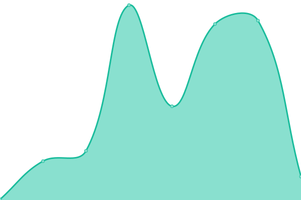
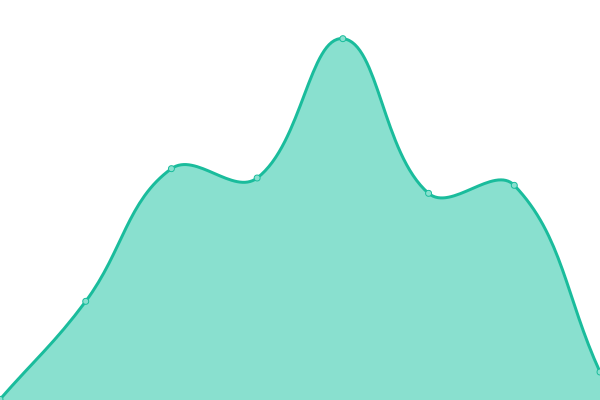
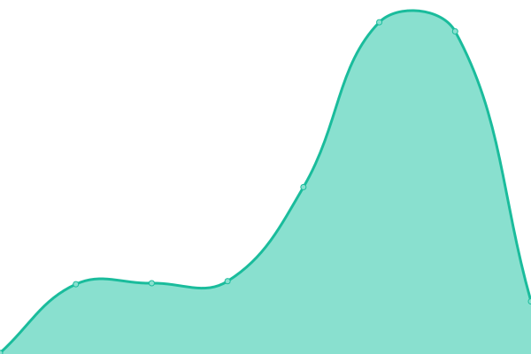

# [📈 Live Status](https://AGO-90.github.io/sga-state-modules): <!--live status--> **🟥 Complete outage**

This repository contains the open-source uptime monitor and status page for [AGO-90](https://AGO-90.github.io/sga-state-modules), powered by [Upptime](https://github.com/upptime/upptime).

With [Upptime](https://upptime.js.org), you can get your own unlimited and free uptime monitor and status page, powered entirely by a GitHub repository. We use [Issues](https://github.com/AGO-90/sga-state-modules/issues) as incident reports, [Actions](https://github.com/AGO-90/sga-state-modules/actions) as uptime monitors, and [Pages](https://AGO-90.github.io/sga-state-modules) for the status page.

<!--start: status pages-->
<!-- This summary is generated by Upptime (https://github.com/upptime/upptime) -->
<!-- Do not edit this manually, your changes will be overwritten -->
<!-- prettier-ignore -->
| URL | Status | History | Response Time | Uptime |
| --- | ------ | ------- | ------------- | ------ |
|  [Products module](https://products-module-java.herokuapp.com/api/v1/test/ping) | 🟥 Down | [products-module.yml](https://github.com/AGO-90/sga-state-modules/commits/HEAD/history/products-module.yml) | 

 117ms
     
 | 

<a href="https://AGO-90.github.io/sga-state-modules/history/products-module">0.00%</a>
    

|  [Users module](https://users-module-go.herokuapp.com/api/v1/ping) | 🟥 Down | [users-module.yml](https://github.com/AGO-90/sga-state-modules/commits/HEAD/history/users-module.yml) | 

 100ms
     
 | 

<a href="https://AGO-90.github.io/sga-state-modules/history/users-module">0.00%</a>
    

|  [Storage module](https://storage-module-java.herokuapp.com/test/ping) | 🟥 Down | [storage-module.yml](https://github.com/AGO-90/sga-state-modules/commits/HEAD/history/storage-module.yml) | 

 97ms
     
 | 

<a href="https://AGO-90.github.io/sga-state-modules/history/storage-module">0.00%</a>
    

<!--end: status pages-->

[**Visit our status website →**](https://AGO-90.github.io/sga-state-modules)

## 📄 License

- Powered by: [Upptime](https://github.com/upptime/upptime)
- Code: [MIT](./LICENSE) © [AGO-90](https://AGO-90.github.io/sga-state-modules)
- Data in the `./history` directory: [Open Database License](https://opendatacommons.org/licenses/odbl/1-0/)
